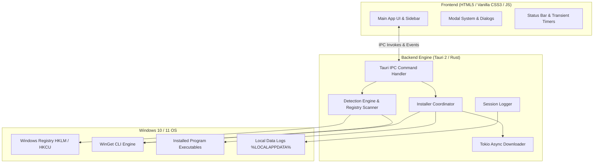

# WinSlimCenter

<p align="center">
  
</p>

<h1 align="center">WinSlimCenter</h1>
<p align="center">
  <strong>Tu centro de aplicaciones y herramientas: rápido, ordenado y bajo control.</strong><br />
  <em>Una tienda de software de alto rendimiento para Windows construida con Tauri 2, Rust y arquitectura web ultraligera.</em>
</p>

<p align="center">
  
  
  
  
  
</p>

---

## 📋 Índice

- [Visión General](#-visión-general)
- [Características Destacadas](#-características-destacadas)
- [Catálogo de Aplicaciones](#-catálogo-de-aplicaciones)
- [Arquitectura Técnica](#-arquitectura-técnica)
- [Diseño y Sistema de Estilos](#-diseño-y-sistema-de-estilos)
- [Compilación e Instalación](#-compilación-e-instalación)
- [Diagnósticos y Registros](#-diagnósticos-y-registros)
- [Estructura del Proyecto](#-estructura-del-proyecto)
- [Licencia](#-licencia)

---

## 📖 Visión General

**WinSlimCenter** es un gestor y catálogo de software de escritorio nativo para Windows. Nació con el objetivo de ofrecer una alternativa **ligera, sin publicidad, sin telemetría** y extremadamente rápida frente a la tienda estándar de Windows o la descarga manual desde navegadores.

Combina la seguridad y velocidad de **Rust** en el backend con la flexibilidad de un frontend **HTML/CSS/JavaScript** moderno, permitiendo descubrir, instalar, actualizar, ejecutar y desinstalar más de 200 programas en segundos.

> [!TIP]
> **Sin consumo de recursos en segundo plano**: WinSlimCenter se ejecuta con huella de memoria reducida (~40MB RAM) y libera por completo la CPU cuando no hay tareas activas.

---

## ✨ Características Destacadas

### 📦 Gestión Multiorigen de Aplicaciones
- **WinGet Engine (`winget.exe`)**: Integración completa con Windows Package Manager para instalaciones y actualizaciones silenciosas.
- **Descargas Directas (`wget`)**: Descarga e instalación asistida de ejecutables (`.exe`) e instaladores MSI (`.msi`). Cuando el instalador viaja comprimido, `installer_in_archive` indica que el `.zip` es solo un envoltorio y se ejecuta el setup que contiene en lugar de tratarlo como portable.
- **GitHub Release Sync**: Resolución dinámica de activos desde repositorios de código abierto de GitHub.
- **Lanzadores y Enlaces Web**: Enlaces hacia instaladores web oficiales y tiendas secundarias.

### ⚡ Automatización y Ejecución Inteligente
- **Auto-Launch Post-Instalación**: Al completar con éxito la instalación de una aplicación WinGet, WinSlimCenter inicia automáticamente el programa.
- **Desinstalación Nativa Ultrarrápida**: Escaneo del registro de Windows (`HKLM`/`HKCU` `Uninstall`) y desinstalación directa sin diálogos redundantes.
- **Caché en Memoria Thread-Safe**: Verificación de paquetes WinGet optimizada mediante caché temporal de 3 segundos para evitar bloqueos del proceso.
- **Filtros Interactivos por Consola**: Filtrado instantáneo en la sección de Emuladores (*PS1, PS2, PS3, PSP, Xbox, GameCube, Wii, Switch, N64, Game Boy, Sharp, etc.*).

### 🎨 Apariencia y Personalización Premium
- **Diseño Oscuro Minimalista**: Estética profesional basada en tarjetas con efectos de iluminación, bordes suaves y tipografía refinada.
- **Sistema de Presets**: Apariencias predefinidas (*Plata, Índigo, Esmeralda, Carmesí, Ámbar*) y selector de color de acento HEX personalizado.
- **Notificaciones de Estado Inteligentes**: Mensajes temporales de 5 y 10 segundos que retornan automáticamente al resumen en reposo (*"Todo al día · 202 aplicaciones"*).

---

## 📚 Catálogo de Aplicaciones

El catálogo (`apps.json`) incluye **más de 200 aplicaciones** divididas en 9 grandes categorías:

<details>
<summary><strong>Ver categorías y aplicaciones destacadas</strong></summary>

| Categoría | Ejemplo de Aplicaciones Incluidas |
| :--- | :--- |
| **⭐ Destacados** | WinSlimTerminal, Microsoft PowerToys, Visual Studio Code, Brave, 7-Zip, VLC, OBS Studio, RustDesk, Steam, Discord |
| **🌐 Navegadores** | Brave, Mozilla Firefox, Google Chrome, Microsoft Edge, Vivaldi, Opera, Tor Browser, Waterfox, LibreWolf |
| **💻 Desarrollo** | Visual Studio Code, Visual Studio 2022, Git, Node.js, Python, Rust, Docker Desktop, Android Studio, DBeaver, Postman |
| **🛠️ Utilidades** | 7-Zip, WinRAR, PeaZip, Everything, Rufus, Ventoy, Process Hacker, CrystalDiskInfo, HWiNFO, AMD Ryzen Master |
| **🎬 Multimedia** | VLC Media Player, OBS Studio, Audacity, Blender, GIMP, Krita, Aseprite, Handbrake, DaVinci Resolve |
| **📝 Productividad** | LibreOffice, Notion, Obsidian, PDF24 Creator, ShareX |
| **💬 Social y Comunicación** | Discord, Telegram Desktop, WhatsApp, Signal, Element, Zoom |
| **🎮 Juegos** | Steam, Epic Games Launcher, GOG GALAXY, EA App, Ubisoft Connect, Rockstar Games Launcher, Heroic Games Launcher |
| **🕹️ Emuladores** | PCSX2, RPCS3, DuckStation, PPSSPP, xemu, Xenia, Dolphin, Cemu, Ryujinx, mGBA, RetroArch, Ares, 86Box, SharpEmu, EasyRPG |

</details>

---

## 🛠️ Arquitectura Técnica



### Componentes de Software

| Fichero | Función Principal |
| :--- | :--- |
| [src-tauri/src/lib.rs](file:///c:/Users/Administrador/Desktop/WinSlimCenter_Git/WINSLIM_CENTER_STORE/src-tauri/src/lib.rs) | Punto de entrada Tauri, gestión de estado (`AppState`), comandos IPC y cola de tareas. |
| [src-tauri/src/installer.rs](file:///c:/Users/Administrador/Desktop/WinSlimCenter_Git/WINSLIM_CENTER_STORE/src-tauri/src/installer.rs) | Coordinador de instalación/desinstalación, ejecución silenciosa y resolución de ejecutables. |
| [src-tauri/src/detect.rs](file:///c:/Users/Administrador/Desktop/WinSlimCenter_Git/WINSLIM_CENTER_STORE/src-tauri/src/detect.rs) | Escáner del Registro de Windows, paquetes WinGet (con caché de 3s) y accesos UWP (`shell:`). |
| [src-tauri/src/download.rs](file:///c:/Users/Administrador/Desktop/WinSlimCenter_Git/WINSLIM_CENTER_STORE/src-tauri/src/download.rs) | Gestor de descargas HTTP asíncronas con Tokio, pausa, reanudación y cancelación. |
| [src-tauri/src/logger.rs](file:///c:/Users/Administrador/Desktop/WinSlimCenter_Git/WINSLIM_CENTER_STORE/src-tauri/src/logger.rs) | Sistema de diarios de sesión rotativos (`%LOCALAPPDATA%\CenterApps\logs`). |
| [src-tauri/src/process.rs](file:///c:/Users/Administrador/Desktop/WinSlimCenter_Git/WINSLIM_CENTER_STORE/src-tauri/src/process.rs) | Ejecución de procesos ocultos y elevación de privilegios UAC mediante `ShellExecuteExW`. |
| [src/main.js](file:///c:/Users/Administrador/Desktop/WinSlimCenter_Git/WINSLIM_CENTER_STORE/src/main.js) | Lógica interactiva del cliente, renderizado dinámico de tarjetas, banners y barra de estado. |
| [src/styles.css](file:///c:/Users/Administrador/Desktop/WinSlimCenter_Git/WINSLIM_CENTER_STORE/src/styles.css) | Sistema de diseño en Vanilla CSS, tokens HSL, animaciones y temas. |

---

## 🎨 Diseño y Sistema de Estilos

El diseño visual está construido con **Vanilla CSS** nativo y variables personalizables:

- **Tokens Principales**:
  - `--bg-app`: Fondo principal de la aplicación (`#181818`)
  - `--bg-sidebar`: Panel lateral (`#101010`)
  - `--bg-card`: Tarjeta de aplicación (`#202020`)
  - `--bg-card-hover`: Animación al pasar el cursor (`#282828`)
  - `--accent`: Color de acento personalizable (`#d8d8d8`, `#3b82f6`, `#10b981`, `#ef4444`, `#f59e0b`)

---

## 🚀 Compilación e Instalación

### Requisitos de Entorno
1. **Node.js** (v18 o superior)
2. **Rust Toolchain** (`x86_64-pc-windows-msvc`)
3. **Visual Studio 2022 Build Tools** (con carga de trabajo de desarrollo en C++)

### Comandos de Compilación

1. Instalar dependencias npm:
   ```bash
   npm install
   ```

2. Ejecutar el script automatizado de compilación:
   ```cmd
   .\build.cmd
   ```

3. El ejecutable compilado estará disponible en:
   ```text
   WINSLIM_CENTER_STORE\Build\WinSlimCenter.exe
   ```

---

## 🔍 Diagnósticos y Registros

WinSlimCenter incluye un sistema de diagnóstico integrado:

- **Abrir logs desde la app**: Escribe `/logs` en la barra de búsqueda de la aplicación y presiona `Enter`.
- **Ubicación de archivos**:
  ```text
  %LOCALAPPDATA%\CenterApps\logs\WinSlimCenter-YYYYMMDD-HHMMSS-PID.log
  ```
- **Conservación**: Se mantienen automáticamente las últimas 20 sesiones de registro para investigar instalaciones, desinstalaciones o errores sin saturar el disco.

---

## 📁 Estructura del Proyecto

```text
WINSLIM_CENTER_STORE/
├── Build/                      # Salida del ejecutable (WinSlimCenter.exe)
├── src/                        # Código fuente del Frontend
│   ├── assets/                 # Logotipos e imágenes del proyecto
│   ├── index.html              # Estructura principal de la interfaz
│   ├── main.js                 # Lógica interactiva del cliente
│   └── styles.css              # Sistema de diseño CSS y tokens
├── src-tauri/                  # Backend en Rust (Tauri 2)
│   ├── src/                    # Módulos de Rust (lib, detect, installer, etc.)
│   ├── apps.json               # Catálogo completo de aplicaciones (200+ apps)
│   ├── Cargo.toml              # Dependencias de Rust
│   └── tauri.conf.json         # Configuración de Tauri 2
├── .gitignore                  # Archivos ignorados en Git
├── build.cmd                   # Script oficial de compilación en Windows
├── package.json                # Scripts npm
├── README.md                   # Documentación principal del repositorio
└── LICENSE                     # Licencia GPL-3.0
```

---

## 📜 Licencia

Este proyecto está bajo la licencia **GNU General Public License v3.0**. Para más información, consulta el archivo [LICENSE](file:///c:/Users/Administrador/Desktop/WinSlimCenter_Git/WINSLIM_CENTER_STORE/LICENSE).
